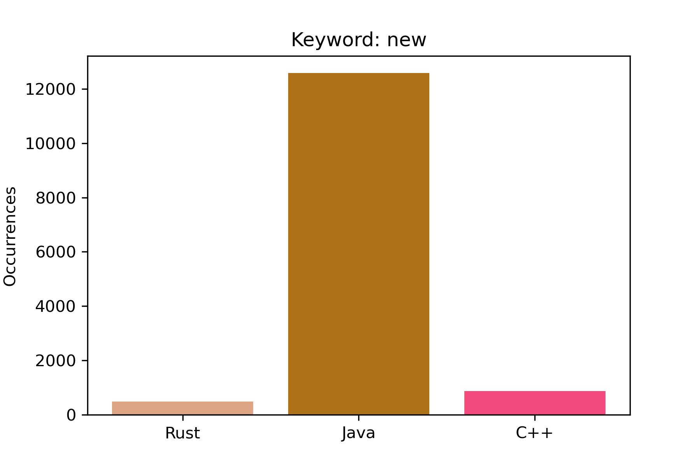
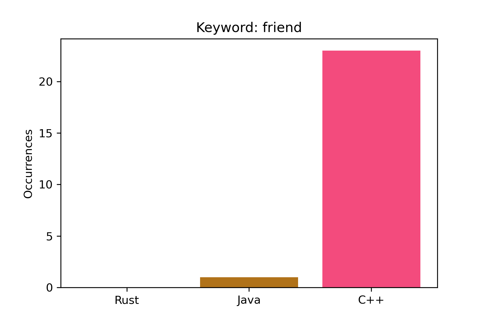
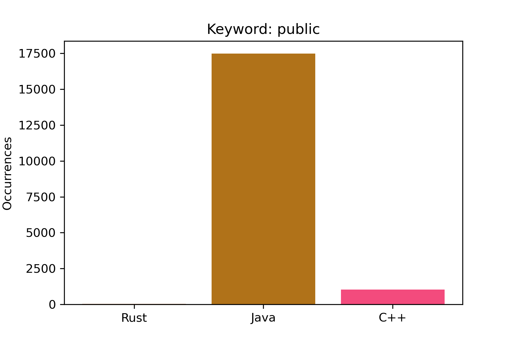
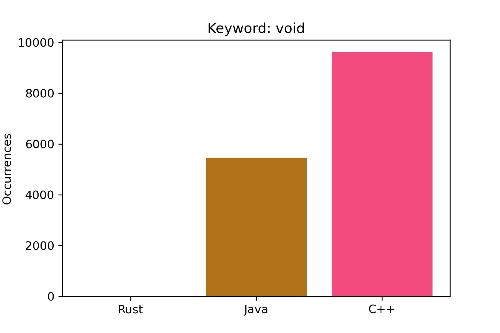
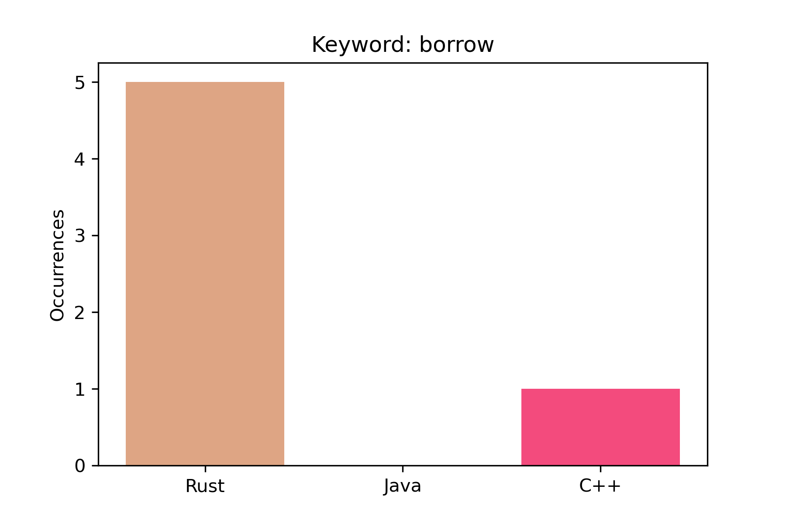
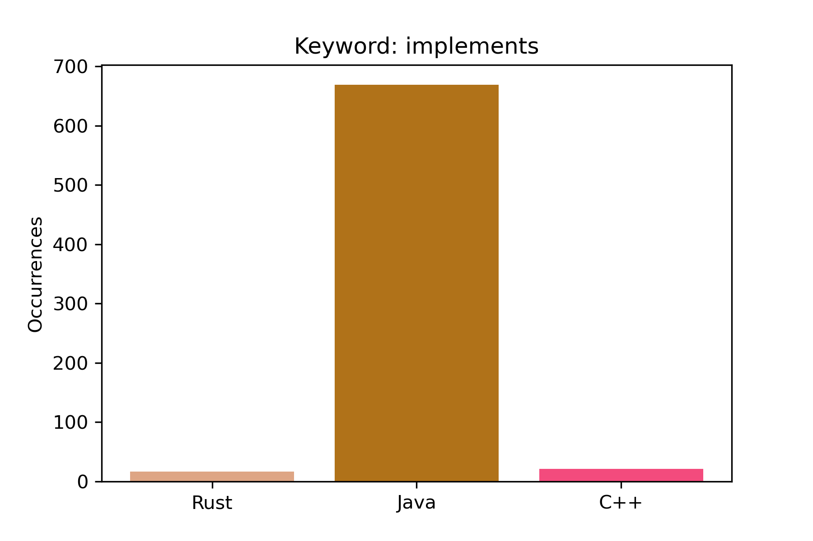
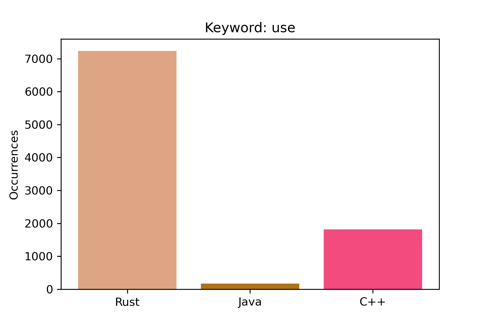

# Chimera

This project aims to determine the programming language used in a given input file
without relying on the file extension.

Supported languages:
- C++
- Java
- Rust

# Contents

1 .[Samples](#Samples)

2 .[Math model](#Math-model)

3 .[Project Structure](#Project-Structure)

4 .[Run locally](#Run-locally)

5 .[Parsing interpretation](#Parsing-interpretation)

6 .[Results](#Results)

7 .[References](#References)

# Math model

## TODO:

# Samples

This project includes scripts for data collection and the results obtained,
but not the projects themselves.
The projects used are listed in the References section.

The results of the data parsing are located at "chimera/{language}_results.txt".
You can modify what tokens should be considered by modifying the file "chimera/keywords.txt".

# Project structure

To use your sample data create a `cpp`, `rs` and `java` drectory inside "chimera/data-parser/samples",
your tree should look something like this:
```bash
.
├── cpp_results.txt
├── java_results.txt
├── keywords.txt
├── main.py
├── parser.py
├── README.md
├── requirements.txt
├── rs_results.txt
├── samples
│   ├── cpp-repo
│   ├── java-repo
│   └── rust-repo
└── tests.txt
```

# Run locally

```bash
git clone git@github.com:lucan8/chimera.git
cd chimera
pip install -r requirements.txt

// To run with your own training date make sure to follow the the
// information presented in "Project structure".

python3 main.py
```

To add your own samples do the following:
```bash
cd chimera
mkdir samples
cd samples

git clone <ssh_for_project1> --depth=1
git clone <ssh_for_project2> --depth=1

// Analyze the new projects
python3 parser.py

python3 main.py
...
```

# Parsing interpretation

After you run the parser a file will be generated for each programming language,
where is what everything means:

```
rs_results.txt
--------------

total tokens in all the .rs files
|
|        total number of .rs files
|        |
v        v
1514129 855
        
keyword
|
|    number of times the keyword appeard
|    |
v    v
new 489
...
```
# Results





















# References

## Samples repos
- For C++: https://github.com/opencv/opencv
- For Java: https://github.com/plantuml/plantuml
- For Rust: https://github.com/zed-industries/zed
