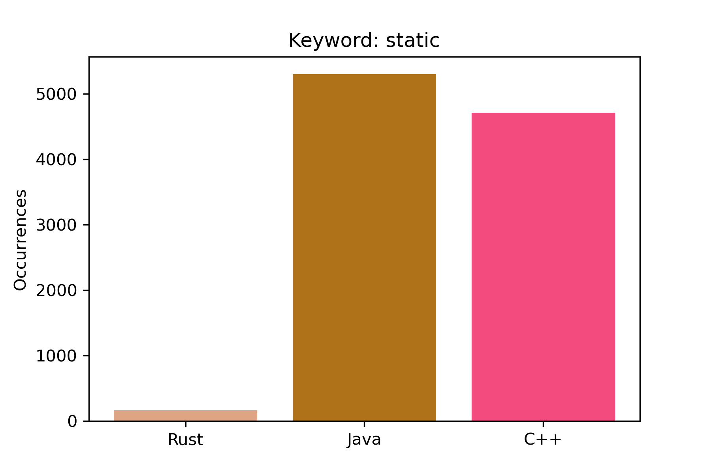
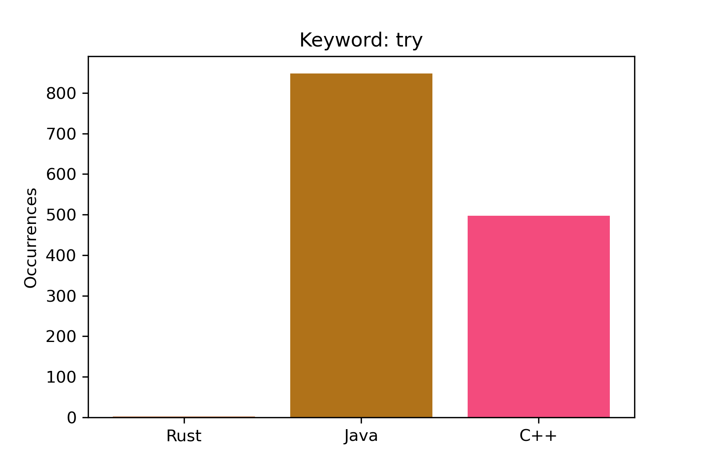
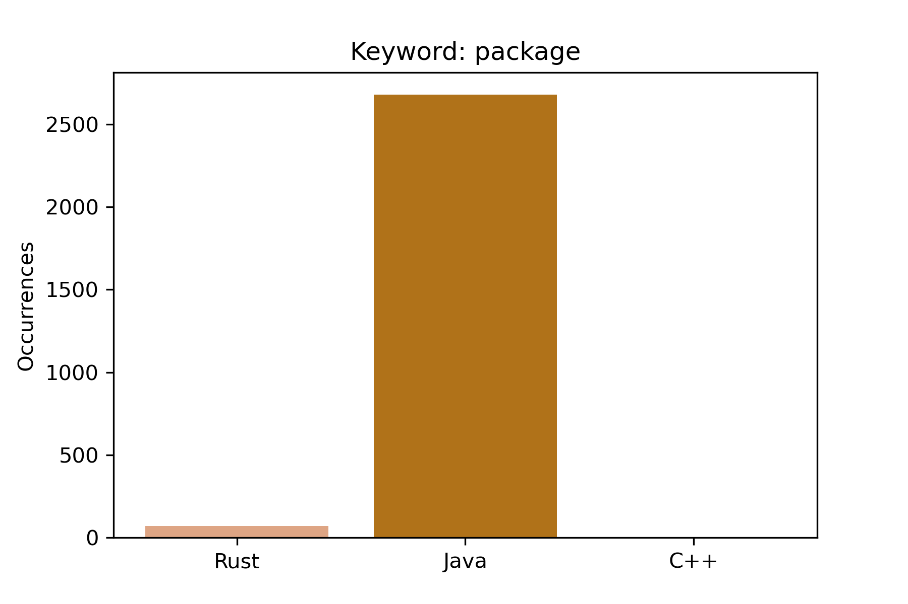
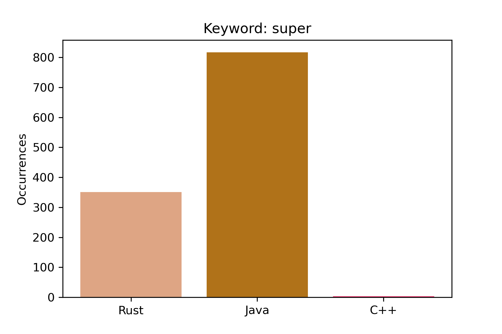
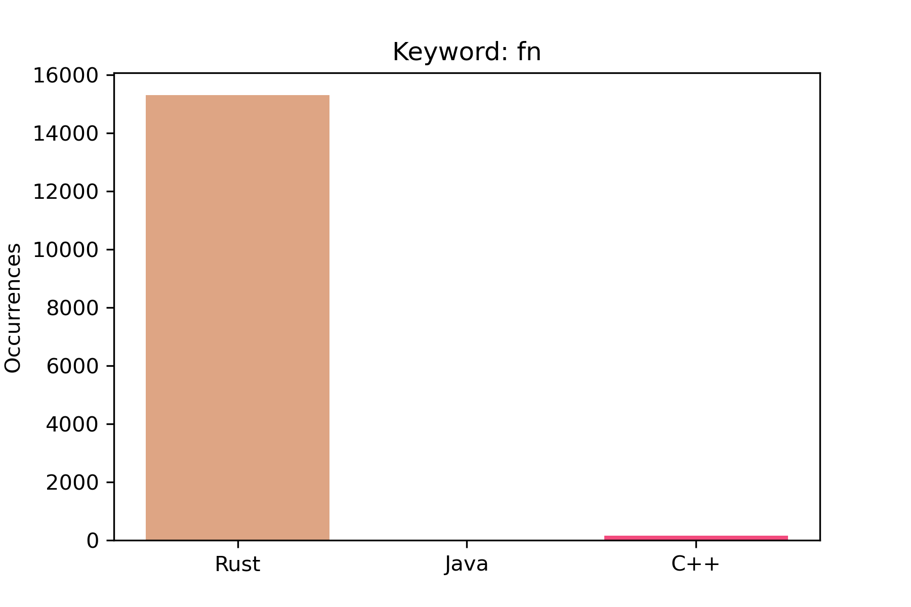
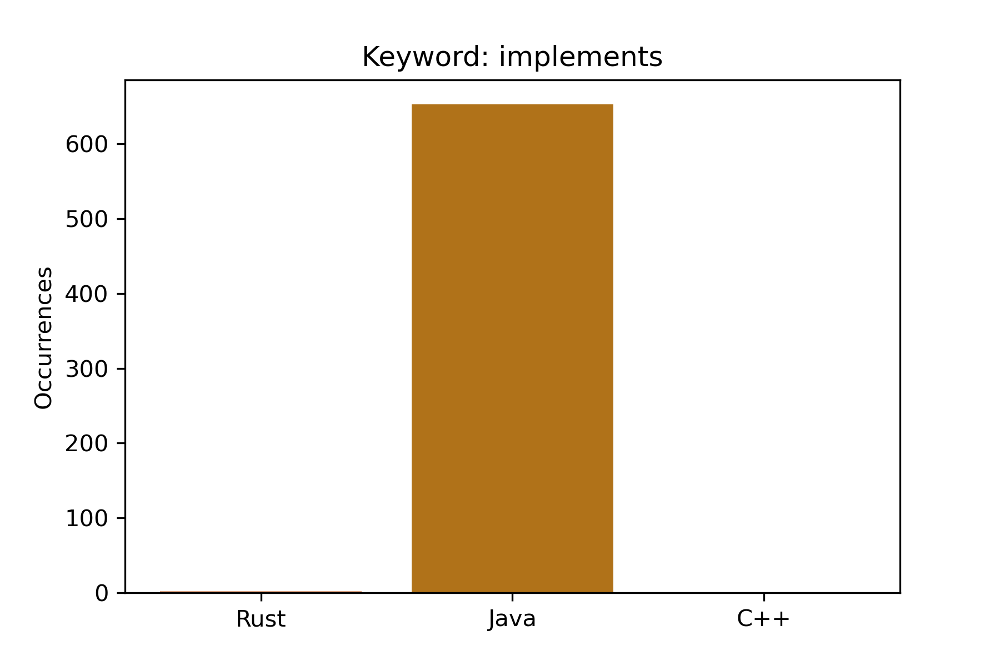
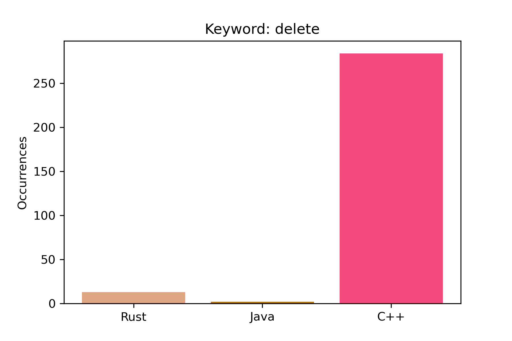
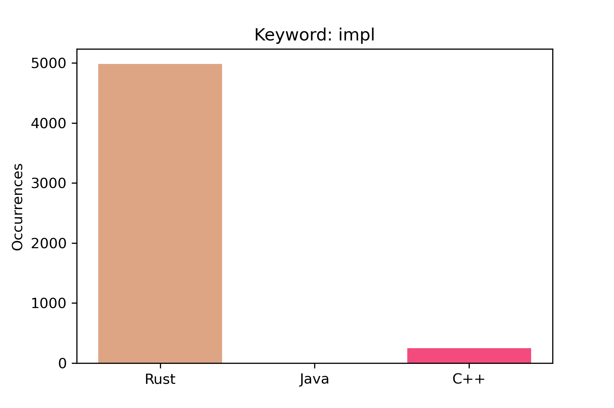
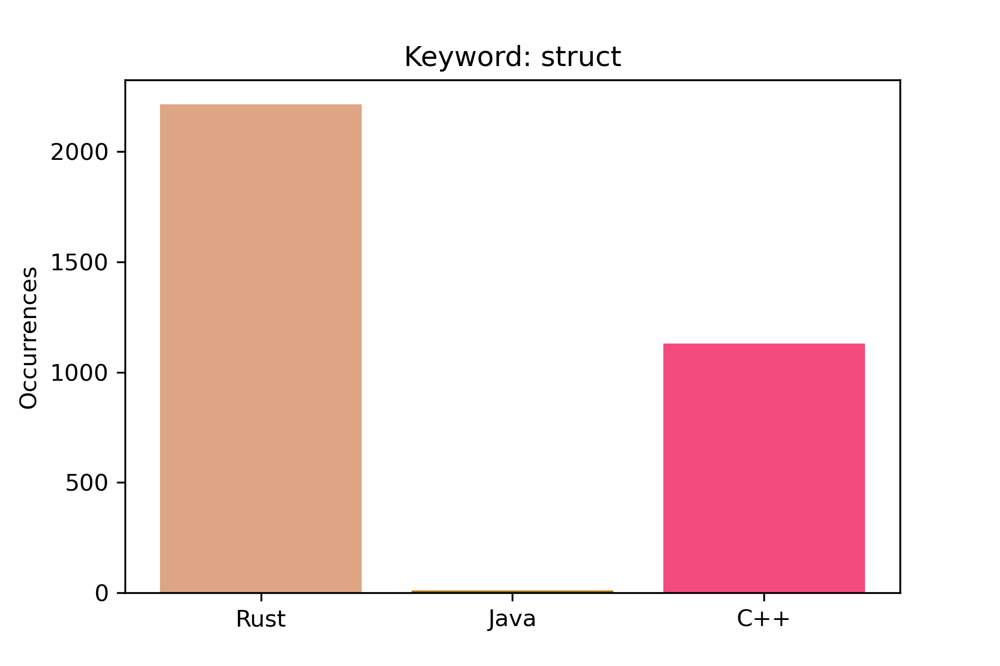
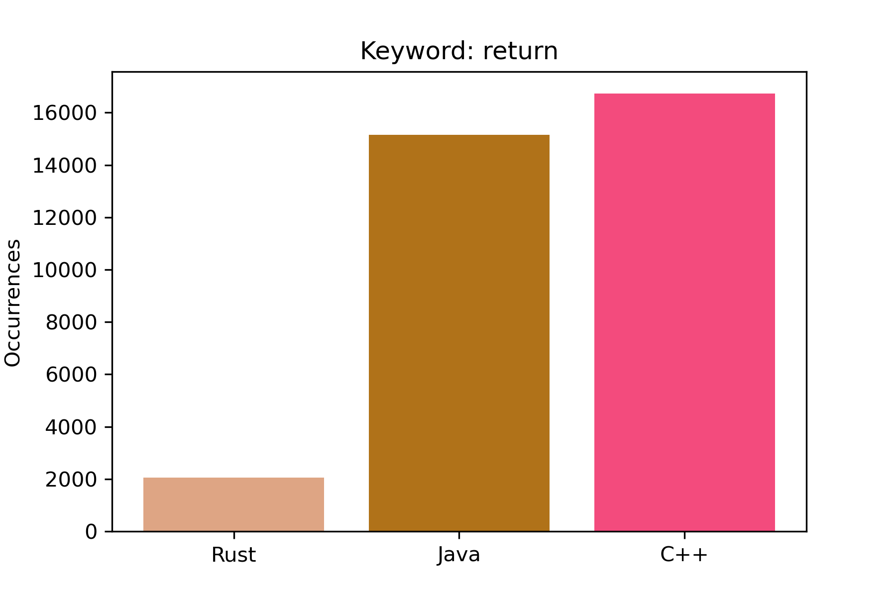

# Chimera

This project aims to determine the programming language used in a given input file
without relying on the file extension.

Supported languages:
- C++
- Java
- Rust

# Contents

1 .[Math model](#Math-model)

3 .[Run locally](#Run-locally)

4 .[Results](#Results)

5 .[References](#References)

# Math model

## TODO:

# Run locally

We do not provide the samples we use directly, what we provide are the results
of our training which you can just use. If you wish to train this model with
your own data we do provide the mechanism for this.

Regardless of your choice you should first do:

```bash
git clone git@github.com:lucan8/chimera.git
cd chimera
pip install -r requirements.txt
```

### Use our results

Find a source code you would like to test (remember as of now we only can
test for C++, Rust and Java) and put the file contents in `input.txt`, now run
`python3 main.py` and that is our prediction.

### Use your own data

To train our model you will need lots of `.rs`, `.cpp` and `.java` files,
we recommend you clone repos for this, we used [this repos](#References).

`parser.py` will do the heavy lifting for your, just make sure you clone the repos
inside a directory `samples` (it is not in the repo by default).

```bash
mkdir samples
cd samples

// depth = 1 to clone the repos faster
git clone <ssh_for_project1> --depth=1
git clone <ssh_for_project2> --depth=1

...
more repos
...

cd ..

// To analyze the repos and split the files into test files and train files
python3 parser.py

// Train the model
python3 train.py

// (Optional) This will generate graphs for every keyword and show how many
// times a keyword appears in each language.
//
// The plots are in the `plots` directory.
python3 keywords_plot.py

// Add your sample input to input.txt
cat > input.txt (or just use a text editor)

// Make a prediction
python3 main.py
```

You could also change the keywords that are being used, if you wish to do so
just change `keywords.txt`.

The results of the parsing are in `{language}_results.txt`, here is what
everything means:

```
rs_results.txt
--------------

total tokens in all the .rs files
|
|        total number of .rs files
|        |
v        v
1514129 855
        
keyword
|
|    number of times the keyword appeared
|    |
v    v
new 489
...
```
# Results

In `results.png` the light green means how many of the test data were of that
programming language type, the light blue means how many of that programming
language the model predicted.

So we can notice two interesting facts:

1. The model predicted that there are more `Java` files than there were
(not so surprising knowing that there were more Java files than the rest).

2. The dark green you see is the combination of the two colors and it shows
how it guessed relative to how many there were.




























# References

## Samples repos
- For C++: https://github.com/opencv/opencv
- For Java: https://github.com/plantuml/plantuml
- For Rust: https://github.com/zed-industries/zed
